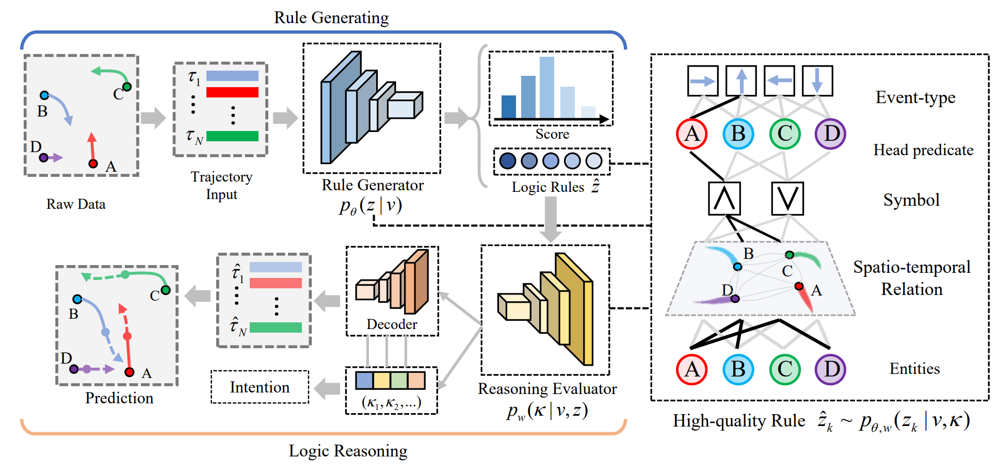

# STLR

This repository provides the implementation of the paper: Discovering Intrinsic Spatial-Temporal Logic Rules to Explain Human Actions.

Advances in Neural Information Processing Systems 36 pre-proceedings (NeurIPS 2023)

 [Paper Link](https://proceedings.neurips.cc/paper_files/paper/2023/hash/d69fdbe4d13080bb7fa33249ca136976-Abstract-Conference.html)



We propose a logic-informed knowledge-driven modeling framework for human movements by analyzing their trajectories. Our approach is inspired by the fact that human actions are usually driven by their intentions or desires, and are influenced by environmental factors such as the spatial relationships with surrounding objects.
In this paper, we introduce a set of spatial-temporal logic rules as knowledge to explain human actions. These rules will be automatically discovered from observational data. To learn the model parameters and the rule content, we design an expectation-maximization (EM) algorithm, which treats the rule content as latent variables. The EM algorithm alternates between the E-step and M-step: in the E-step, the posterior distribution over the latent rule content is evaluated; in the M-step, the rule generator and model parameters are jointly optimized by maximizing the current expected log-likelihood. Our model may have a wide range of applications in areas such as sports analytics, robotics, and autonomous cars, where understanding human movements are essential. We demonstrate the model’s superior interpretability and prediction performance on pedestrian and NBA basketball player datasets, both achieving promising results.


## Dependencies

- Python
- torch
- scikit-image
- numpy==1.19.4
- scikit_learn==1.0.1
- scipy==0.19.1
- tqdm
- pandas


## Dataset

**Synthetic dataset**
We follow [Logic_Point_Processes](https://github.com/FengMingquan-sjtu/Logic_Point_Processes_ICLR) to prepare the data. The logic rules contain temporal relations and spatial relations.


```
python generate_data.py
```
dataset_id denotes the index of dataset. You can design specific predicates and relation types based on the dataset you are using.


**NBA dataset**

It is collected by NBA using the SportVU tracking system, which reports the trajectories of the ten players and the ball in real basketball games. Each trajectory contains the 2D positions and velocities of the offensive team, consisting of 5 players. We predict the future 10 timestamps (4.0s) based on the historical 5 timestamps (2.0s). 

Please follow [this link](https://github.com/linouk23/NBA-Player-Movements/tree/master) to prepare the data. The instructions are copied here: 


1. Clone this repo:
```
git clone https://github.com/linouk23/NBA-Player-Movements
```

2. Choose any NBA game from ```data/2016.NBA.Raw.SportVU.Game.Logs``` directory.

3. Generate an animation for the play by running the following script:
```
python dataset/main.py --event=140
```

```
  --path PATH    a path to json file to read the events from

optional arguments:
  --event EVENT  an index of the event to create the animation to
                 (the indexing start with zero, if you index goes beyond out
                 the total number of events (plays), it will show you the last
                 one of the game)
  -h, --help     show the help message and exit
```


## License

This project is licensed under the MIT License - see the [LICENSE.md](LICENSE.md) file for details.


## References

[1] [Mohamed A, Zhu D, Vu W, et al. Social-implicit: Rethinking trajectory prediction evaluation and the effectiveness of implicit maximum likelihood estimation[C]//European Conference on Computer Vision. Cham: Springer Nature Switzerland, 2022: 463-479.](https://arxiv.org/pdf/2203.03057.pdf) <br />
[2] [Li S, Feng M, Wang L, et al. Explaining point processes by learning interpretable temporal logic rules[C]//International Conference on Learning Representations. 2021.](https://openreview.net/pdf?id=P07dq7iSAGr) <br />
[3] [Li S, Wang L, Zhang R, et al. Temporal logic point processes[C]//International Conference on Machine Learning. PMLR, 2020: 5990-6000.](https://proceedings.mlr.press/v119/li20p/li20p.pdf) <br />


## Citation

Please consider citing the following paper if you find our codes helpful. Thank you!

```
@inproceedings{
cao2023discovering,
title={Discovering Intrinsic Spatial-Temporal Logic Rules to Explain Human Actions},
author={Chengzhi Cao and Chao Yang and Ruimao Zhang and Shuang Li},
booktitle={Thirty-seventh Conference on Neural Information Processing Systems},
year={2023},
url={https://openreview.net/forum?id=avuRopYsCg}
}
```

## Contact
Should you have any question, please contact chengzhicao@mail.ustc.edu.cn.